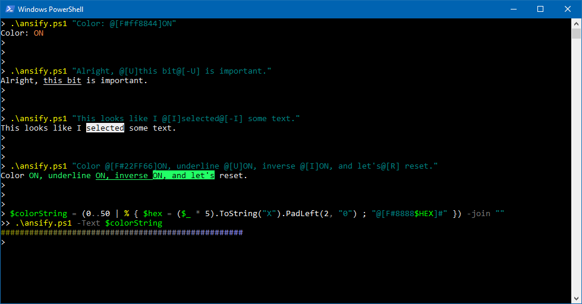

# ansify

Encode ANSI escape codes into a string, to add text decorations.

## Patterns

### Reset

Reset all text decorations.

**Pattern:** `@[R]`

### Colors

Set the RGB color value of the fore- or background.

**Pattern:** `@[C#RRGGBB]`

**Explanation:**

-  **C:** The color layer; "F" for foreground, "B" for background.
- **#RRGGBB:** The hex code of the color (note: must be 6 characters long).

### Underline

Enables underline.

**Pattern:** `@[U]`

### Underline off

Disables underline.

**Pattern:** `@[-U]`

### Inverse

Enables inverse colors.

**Pattern:** `@[I]`

### Inverse off

Disables inverse colors.

**Pattern:** `@[-I]`
