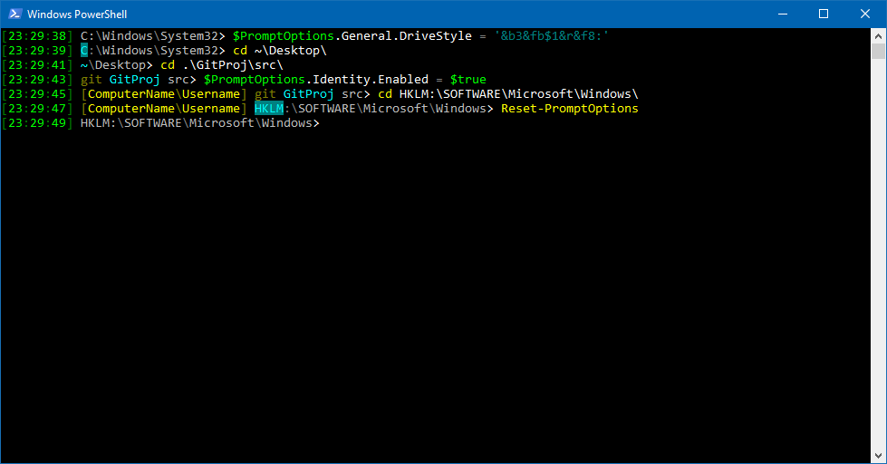

# Custom prompt

## Description

A dynamic, customizable prompt function (the text displayed before what you type, usually your current working directory) for PowerShell.

The script comes in two version:

- For PowerShell 7, cross-platform compatible.
- For PowerShell 5, for Windows only.

## Requirements

For the PowerShell 7 version:
- PowerShell version 5 or greater.

For the PowerShell 5 version:
- PowerShell version 5 or greater.

## Installation

Simply copy the script text into your `$PROFILE` file. The next time you start PowerShell, the custom prompt will be used.

Alternatively, the script can be added to your `$PROFILE` file as follows:

For the PowerShell 7 version:

`(iwr https://raw.githubusercontent.com/DevAndersen/posh-bucket/master/projects/customPrompt/prompt.ps1).Content >> $PROFILE`

For the PowerShell 5 version:

`(iwr https://raw.githubusercontent.com/DevAndersen/posh-bucket/master/projects/customPrompt/prompt_powershell5.ps1).Content >> $PROFILE`

## Features

The prompt function concatinates a number of customizable segments (in a customizable order), all of which can be customized by editing the `$PromptOptions` variable.

When the `$PromptOptions` variable is changed, the prompt will change according right away.

For changes to the `$PromptOptions` variable to persist, use the `Save-PromptOptions` function. This will save to the 'promptOptions.json' file, located in the same directory as the `$PROFILE` file.

For in-depth documentation of the values, check the script source code.

Please note that PowerShell 5 and 7 do not share the same `$PROFILE` file. Therefor, if using both versions of the prompt script, changing one version's prompt options does not affect that of the other.

### Prefix

A simple, static prefix text (defaults to "PS "), similarly to what is seen in the standard PowerShell prompt function.

Disabled by default.

### Clock

A clock that shows when the prompt function was executed. Useful for keeping track of when your previous command or script completed.

Defaults to a 24-hour format (HH:mm:ss).

### Identity

Shows the current machine- and user name.

Disabled by defailt.

### Git

If the current directory is within a Git repository, shows an indicator of this and shortens the prompt to only show the repository-relative path. The name of the repository root directory will be highlighted.

### Relative home

If the current working directory is, or is within, the current user's home directory ($HOME), the $HOME part is replaced.

By default it replaces with "~". This shortens the length of the prompt, while it remains a valid PowerShell path.

## Built-in functions

**Save-PromptOptions**

Save the `$PromptOptions` variable on disk.

Changes made to the `$PromptOptions` variable will not be saved unless this function is executed.

**Load-PromptOptions**

Load the `$PromptOptions` variable from disk.

This can be used to undo changes to the `$PromptOptions` variable that have yet to be saved with the `Save-PromptOptions` function.

**Reset-PromptOptions**

Resets the `$PromptOptions` variable to its default values, and saves the variable to disk.

## Applying colors

Colors can be applied to the foreground and background of all parts of the prompt text.

This is done with the following (case insensitive) text patterns.

**Set foreground colors**

- Pattern: `&fH`, with 'H' representing a hexadecimal digit (0-9 and a-f)
- Example: `&f2` sets the foreground color to dark green.

**Set background colors**

- Pattern: `&bH`, with 'H' representing a hexadecimal digit (0-9 and a-f)
- Example: `&be` sets the background color to yellow.

**Reset fore- and background colors**

- Pattern: `&r`

## Presets

In the `presets` directory, you'll find a few presets that sets up alternative prompt options. Simply run the scripts to apply them.
