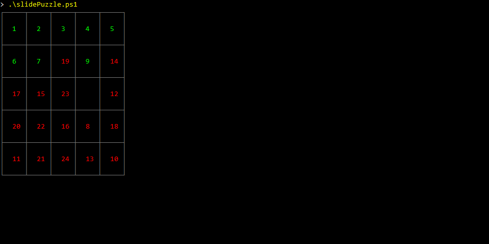

# slidePuzzle

A simple console-based slide puzzle game.

The goal is to put all pieces into the correct places, and end with the empty tile in the bottom-left corner.

Use the arrow keys to move the puzzle pieces around.

The dimensions of the puzzle, the number of pre-game shuffles, and color highlights, are all toggleable via parameters.
